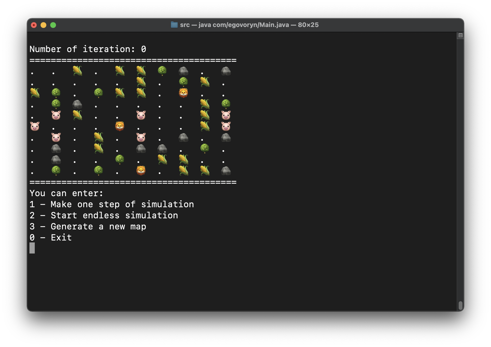
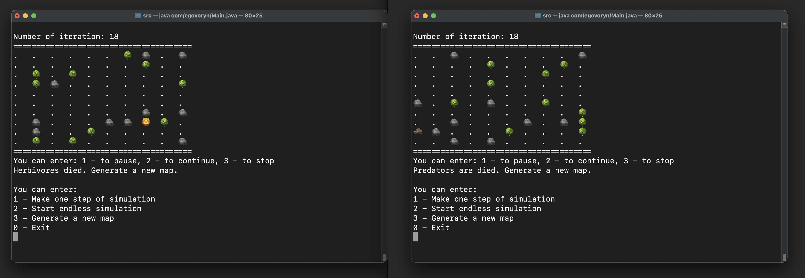
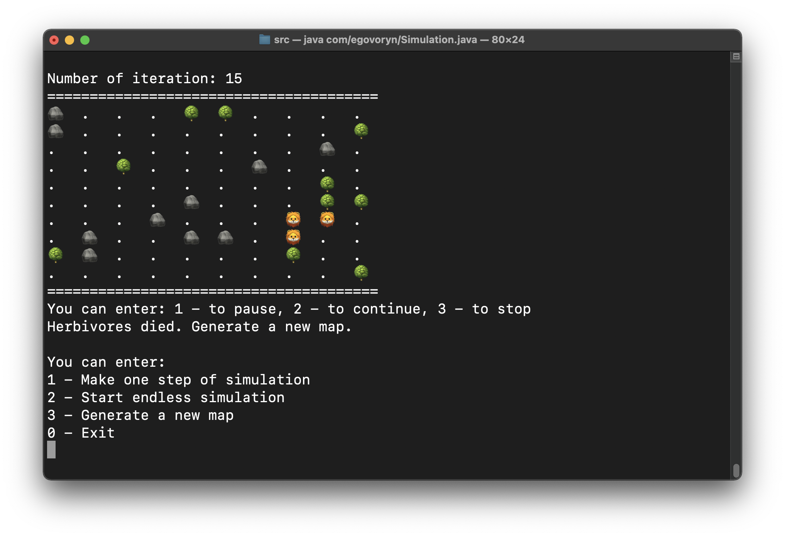

# Проект «Симуляция»

Пошаговая симуляция 2D мира, населённого травоядными и хищниками. Кроме существ, мир содержит ресурсы (траву), которым
питаются травоядные, и статичные объекты, с которыми нельзя взаимодействовать - они просто занимают место.

---

Приложение написано на языке Java в ООП-стиле. В поиске пути используется алгоритм А*.  
Техническое задание проекта: https://zhukovsd.github.io/java-backend-learning-course/Projects/Simulation/

---

## Игровые правила:

* львы ищут свиней, сближаясь с ними – атакуют;
* у свиней есть запас здоровья, у львов – сила урона;
* свиньи ищут кукурузу, сближаясь с ней – мгновенно съедают, но перед львами – они беззащитны;
* кукуруза добавляет свинье небольшое количество здоровья;
* если свинья наберет большое количество здоровья она превращается в кабана;
* кабан также ищет кукурузу, но если рядом с ним находится хищник, кабан атакует его;
* львы воспринимают кабанов, как простых свиней, и охотятся за ними;
* у зверей есть скорость (сколько клеток они могут пройти за 1 итерацию), у львов она вдвое больше свиней;
* у зверей есть голод, при определенном количестве итераций без еды, здоровье зверей уменьшается;
* игра завершается после гибели всех свиней, львов или через символ выхода из симуляции.

# 🦁 🌳 🐷 🌽 🐗

___

## Для успешного запуска приложения:

- откройте терминал
- перейдите в папку `simulation_2d/src/`
- скомпилируйте
  программу `javac com/egovoryn/*.java com/egovoryn/actions/*.java com/egovoryn/dynamics/*.java com/egovoryn/statics/*.java`
- запустите программу `java com/egovoryn/Main.java`

